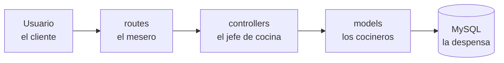
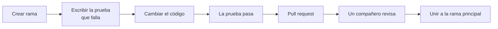

# Guía de resolución de problemas del proyecto

Proyecto ISAILO_MAPS · Septiembre de 2026

## Para qué es esta guía

ISAILO_MAPS ya funciona y está bien organizado; esta guía les muestra, paso a paso, cómo pasar de "funciona en mi computador" a "es seguro y confiable". Los diagnósticos técnicos que les hicieron encontraron 21 puntos por mejorar. Aquí están explicados con comparaciones de la vida real, ejemplos de código de antes y después, y una prueba para saber si cada arreglo quedó bien.

**Cómo leerla.** Cada problema tiene cuatro partes:

1. **¿Qué pasa?** — el problema explicado sin tecnicismos.
2. **¿Por qué importa?** — qué podría salir mal.
3. **Cómo arreglarlo** — el código de antes y el de después.
4. **¿Cómo sé que quedó bien?** — una prueba rápida que pueden hacer ustedes mismos.

**El semáforo de prioridades.** No tienen que arreglar todo al mismo tiempo. Usen este orden:

| Color | Significa | Cuándo hacerlo |
| --- | --- | --- |
| Rojo | Es un riesgo real de seguridad o de datos | Antes de mostrar el proyecto a cualquiera |
| Amarillo | Funciona, pero se va a romper cuando crezca | Después de los rojos |
| Verde | Orden y buenas costumbres | Cuando haya tiempo; suma puntos en la sustentación |

Las palabras técnicas que aparezcan en *cursiva* están explicadas en el glosario al final.

## El diagnóstico en pocas palabras

La estructura del proyecto está bien pensada, y eso es lo más difícil de corregir después; lo que falta es proteger la app y hacer que la base de datos aguante más uso. Empiecen por reconocer lo que ya hicieron bien.

**Lo que ya está bien:**

- El código está separado en capas (`routes → controllers → models → database`) y todas respetan el orden.
- No hay *ciclos de importación*: ningún archivo depende de otro que a su vez dependa de él.
- Las contraseñas se guardan cifradas con `pbkdf2:sha256`, que es un método correcto.
- El frontend escapa el texto con `esc()` antes de mostrarlo, lo que previene muchos ataques.

**La app como un restaurante.** Piensen en ISAILO_MAPS así:



El mesero (`routes`) recibe el pedido, el jefe de cocina (`controllers`) revisa que tenga sentido, los cocineros (`models`) van a la despensa (MySQL) y traen los ingredientes. Este restaurante cocina bien, pero tiene la llave de la despensa pegada en la puerta, no avisa cuando la despensa está cerrada y cada cocinero abre y cierra la puerta por cada ingrediente. Esta guía arregla eso.

**Los problemas por bloque:**

| Bloque | Qué cubre | Rojos | Amarillos | Verdes |
| --- | --- | --- | --- | --- |
| 1. Seguridad | Claves, modo debug, sesiones, contraseñas | 4 | 3 | 1 |
| 2. Base de datos | Conexiones, errores, consultas, esquema | 2 | 5 | 0 |
| 3. Validaciones | Fechas, horas, cerrar sesión | 0 | 2 | 0 |
| 4. Calidad | Pruebas, README, orden de archivos | 0 | 1 | 4 |

## Bloque 1: Seguridad

Este bloque tiene cuatro rojos; sin ellos la app no debería publicarse en Internet. La idea general: nada secreto va dentro del código, y la app no le da pistas a un atacante.

### 1.1 Las claves están escritas dentro del código (Rojo)

**¿Qué pasa?** En `config.py` la clave secreta y el usuario de la base de datos tienen valores "de respaldo" escritos a mano. Es como esconder la llave de la casa debajo del tapete y luego publicar una foto del tapete: el repositorio es la foto.

**¿Por qué importa?** Con la `SECRET_KEY` cualquiera puede fabricar una *cookie de sesión* falsa y entrar como administrador sin saber la contraseña.

**Antes:**

```python
# config.py
SECRET_KEY = os.environ.get('SECRET_KEY', 'isailo-maps-secret-key-2026')
DB_USER = os.environ.get('DB_USER', 'root')
DB_PASSWORD = os.environ.get('DB_PASSWORD', '')
```

**Después:** sin valores de respaldo, y si falta algo la app se niega a arrancar.

```python
# config.py
import os
from dotenv import load_dotenv

load_dotenv()  # lee el archivo .env

class Config:
    SECRET_KEY = os.environ.get('SECRET_KEY')
    DB_HOST = os.environ.get('DB_HOST', 'localhost')
    DB_PORT = int(os.environ.get('DB_PORT', 3306))
    DB_USER = os.environ.get('DB_USER')
    DB_PASSWORD = os.environ.get('DB_PASSWORD')
    DB_NAME = os.environ.get('DB_NAME', 'isailo_maps')

def validar_config():
    faltantes = [k for k in ('SECRET_KEY', 'DB_USER', 'DB_PASSWORD')
                 if not getattr(Config, k)]
    if faltantes:
        raise RuntimeError('Faltan variables en .env: ' + ', '.join(faltantes))
```

Pasos:

1. Instalen `python-dotenv` y agréguenlo a `requirements.txt`. Sin esto, `python app.py` no lee el `.env` (el diagnóstico original no lo menciona).
2. Generen una clave nueva: `python -c "import secrets; print(secrets.token_hex(32))"`. La vieja ya es pública porque está en el historial de Git, así que no sirve.
3. Creen un archivo `.env` con sus valores y agreguen `.env` al `.gitignore`.
4. Creen un `.env.example` con los nombres de las variables pero sin valores, para que otro integrante sepa qué llenar.
5. En `app.py`, llamen `validar_config()` justo después de cargar la configuración.

**¿Cómo sé que quedó bien?** Cambien el nombre del `.env` y arranquen la app: debe fallar con "Faltan variables en .env". Devuélvanle el nombre y debe arrancar.

### 1.2 El administrador se crea con una contraseña fija (Rojo)

**¿Qué pasa?** `database/conexion.py` crea automáticamente el usuario `admin` con la contraseña `isailo2026`, que está escrita en el código. Cualquiera que lea el repositorio puede entrar como administrador.

**Cómo arreglarlo:** crear el administrador con un comando que pregunte la contraseña, en vez de escribirla en el código.

```python
# app.py
import click

@app.cli.command('crear-admin')
@click.option('--usuario', prompt=True)
@click.password_option()
def crear_admin(usuario, password):
    # reutilicen aquí la lógica que ya tienen en _sembrar_admin,
    # pero usando el usuario y la contraseña que llegan como parámetros
    ...
    click.echo('Administrador creado.')
```

Se usa así: `flask crear-admin`, y la terminal pide la contraseña sin mostrarla. Luego borren `_sembrar_admin` o quítenle la contraseña fija.

**¿Cómo sé que quedó bien?** Busquen `isailo2026` en todo el proyecto: no debe aparecer. Iniciar sesión con esa contraseña debe fallar.

### 1.3 La app arranca en modo depuración (Rojo)

**¿Qué pasa?** `app.py` termina con `app.run(debug=True)`. El *modo debug* es como dejar el tablero de control del edificio abierto al público: muestra el código cuando hay un error y trae una consola donde se puede ejecutar cualquier comando.

**Antes:**

```python
if __name__ == '__main__':
    app.run(debug=True)
```

**Después:** el debug solo se enciende si ustedes lo piden en el `.env`.

```python
if __name__ == '__main__':
    app.run(debug=os.environ.get('FLASK_DEBUG') == '1')
```

En su computador ponen `FLASK_DEBUG=1` en el `.env`; en el servidor no lo ponen.

**¿Cómo sé que quedó bien?** Sin `FLASK_DEBUG`, provoquen un error (por ejemplo, una ruta que no existe o una división por cero de prueba): la página no debe mostrar código Python.

### 1.4 Contraseñas de solo 4 caracteres (Amarillo)

**¿Qué pasa?** `clientes_controller.py` acepta contraseñas de 4 caracteres, como `1234`. Un programa las adivina en segundos.

**Antes:** `if len(password) < 4:`

**Después:**

```python
CONTRASENAS_COMUNES = {'12345678', 'password', 'contraseña', 'qwerty123'}

def contrasena_valida(password):
    if len(password) < 8:
        return 'La contraseña debe tener al menos 8 caracteres.'
    if password.lower() in CONTRASENAS_COMUNES:
        return 'Esa contraseña es demasiado común.'
    return None
```

Usen esta misma función en los dos lugares donde hoy validan (crear usuario y cambiar contraseña), para no repetir la regla.

**¿Cómo sé que quedó bien?** Intenten registrar `1234` y `12345678`: las dos deben ser rechazadas con un mensaje claro.

### 1.5 El login deja intentar infinitas veces (Amarillo)

**¿Qué pasa?** Un programa puede probar miles de contraseñas por minuto contra `/api/clientes/login`. Es como un cajero que no bloquea la tarjeta después de tres intentos.

**Cómo arreglarlo** con la librería `Flask-Limiter`:

```python
from flask_limiter import Limiter
from flask_limiter.util import get_remote_address

limiter = Limiter(get_remote_address, app=app, default_limits=['200/hour'])

@clientes_bp.route('/api/clientes/login', methods=['POST'])
@limiter.limit('10/15minutes')
def login_cliente():
    ...
```

**¿Cómo sé que quedó bien?** Intenten entrar 11 veces con una contraseña mala en menos de 15 minutos: el intento 11 debe responder con el código 429 ("demasiadas peticiones").

### 1.6 La cookie de sesión no está protegida (Amarillo)

**¿Qué pasa?** La *cookie de sesión* es el brazalete que les ponen en un evento para no pedirles la boleta cada vez. Hoy ese brazalete se puede copiar con más facilidad de la necesaria.

**Cómo arreglarlo:** cuatro líneas dentro de la clase `Config`.

```python
SESSION_COOKIE_HTTPONLY = True     # JavaScript no la puede leer
SESSION_COOKIE_SECURE = True       # solo viaja por HTTPS
SESSION_COOKIE_SAMESITE = 'Lax'    # otros sitios no la pueden usar
PERMANENT_SESSION_LIFETIME = 60 * 60 * 8  # dura 8 horas
```

Ojo: con `SESSION_COOKIE_SECURE = True` el login no funciona en `http://localhost`. Pónganlo en `False` en su computador (por ejemplo, leyéndolo del `.env`) y en `True` en el servidor con HTTPS.

**¿Cómo sé que quedó bien?** En el navegador: F12 → Application → Cookies. La cookie `session` debe mostrar marcados `HttpOnly` y `SameSite=Lax`.

### 1.7 No hay protección CSRF (Rojo según el diagnóstico)

**¿Qué pasa?** *CSRF* es cuando una página maliciosa hace que el navegador de un usuario ya logueado envíe una orden a ISAILO_MAPS sin que él se dé cuenta, por ejemplo borrar un espacio. Es como alguien que le pasa un papel a firmar a una persona distraída.

**Un matiz honesto.** Si todas sus rutas reciben datos con `request.get_json()` (sin `force=True`) y la cookie tiene `SameSite=Lax` (punto 1.6), el navegador ya bloquea la mayoría de estos ataques. Por eso, si el tiempo es corto, hagan primero el 1.6. Aun así, el token CSRF es la protección estándar y conviene tenerlo.

**Cómo arreglarlo** con `Flask-WTF`, en tres partes:

```python
# app.py
from flask_wtf import CSRFProtect
csrf = CSRFProtect(app)
```

```html
<!-- en el <head> de cada plantilla del panel -->
<meta name="csrf-token" content="{{ csrf_token() }}">
```

```javascript
// static/panel.js, dentro de la función api()
var TOKEN = document.querySelector('meta[name="csrf-token"]').content;
var opciones = {
    method: metodo || 'GET',
    headers: { 'Content-Type': 'application/json', 'X-CSRFToken': TOKEN },
};
```

**¿Cómo sé que quedó bien?** Con Postman o Thunder Client, envíen un `POST` a una ruta del panel sin el encabezado `X-CSRFToken`: debe responder 400. Desde el panel, todo debe seguir funcionando.

### 1.8 Faltan cabeceras de seguridad (Verde)

**¿Qué pasa?** Las *cabeceras* son instrucciones que el servidor le da al navegador con cada página, como "no me muestres dentro de otra página". Hoy la app no envía ninguna.

**Cómo arreglarlo:**

```python
@app.after_request
def cabeceras(resp):
    resp.headers['X-Content-Type-Options'] = 'nosniff'
    resp.headers['X-Frame-Options'] = 'DENY'
    resp.headers['Referrer-Policy'] = 'strict-origin-when-cross-origin'
    return resp
```

El diagnóstico también sugiere una *CSP*. Es más poderosa pero puede romper el visor panorámico o las fuentes si queda mal escrita; déjenla para el final y pruébenla pantalla por pantalla.

**¿Cómo sé que quedó bien?** F12 → Network → clic en cualquier petición → Headers: deben aparecer las tres cabeceras.

## Bloque 2: La base de datos

El centro del problema es una sola función, `get_connection()`: la usan en 37 lugares, no avisa cuando falla y abre una conexión nueva cada vez. Arreglarla bien resuelve tres problemas de una vez (2.2, 2.3 y parte del 2.1).

### 2.1 La base de datos se crea sola al importar la app (Rojo)

**¿Qué pasa?** En `app.py`, la línea `init_db()` está suelta, fuera de cualquier función. Eso significa que cada vez que Python lee el archivo, crea tablas y el usuario administrador. Es como si cada vez que alguien abre la puerta del restaurante, el edificio se volviera a construir.

**¿Por qué importa?** Las pruebas automáticas (Bloque 4) necesitan importar la app sin tocar la base de datos real. Hoy es imposible.

**Antes:**

```python
# app.py
init_db()   # se ejecuta siempre, apenas se importa
```

**Después:** un comando que ustedes ejecutan cuando lo necesitan.

```python
# app.py
import click
from database.conexion import init_db

@app.cli.command('init-db')
def init_db_command():
    if init_db():
        click.echo('Base de datos inicializada.')
    else:
        click.echo('No se pudo inicializar la base de datos.', err=True)
```

Se usa una sola vez al instalar: `flask init-db`.

**¿Cómo sé que quedó bien?** Apaguen MySQL y ejecuten `python -c "import app"`: no debe salir ningún error de conexión.

### 2.2 Cuando la base de datos falla, la app se queda callada (Rojo)

**¿Qué pasa?** Si MySQL está apagado, `get_connection()` imprime un mensaje en la consola y devuelve `None`. Luego los modelos responden con una lista vacía. El usuario ve "no hay espacios" cuando en realidad la despensa está cerrada. Es como un mesero que, en vez de decir "se fue la luz en la cocina", dice "no tenemos nada en el menú".

**Antes:**

```python
def get_connection():
    try:
        return mysql.connector.connect(...)
    except Error as e:
        print(f'Error al conectar a la base de datos: {e}')
        return None
```

**Después:** dejar que el error suba y atraparlo en un solo lugar que responda con un mensaje claro.

```python
# app.py
from flask import jsonify
from mysql.connector import Error

@app.errorhandler(Error)
def error_base_de_datos(e):
    app.logger.error('Error de base de datos: %s', e)
    return jsonify({'ok': False,
                    'error': 'Servicio temporalmente no disponible.'}), 503
```

**¿Cómo sé que quedó bien?** Apaguen MySQL y abran el panel: debe aparecer un mensaje de error, no una lista vacía. Revisen que `panel.js` muestre ese mensaje al usuario.

### 2.3 Cada consulta abre y cierra una conexión nueva, repetido 37 veces (Amarillo)

**¿Qué pasa?** Abrir una conexión con MySQL es lento, como hacer fila en la entrada cada vez que uno quiere un ingrediente. Además, los 37 métodos de los modelos repiten el mismo bloque de `try/except/finally`. Si hay que cambiar algo, hay que cambiarlo 37 veces.

**Cómo arreglarlo, en dos piezas.** Primero, un *pool de conexiones*: un grupo de conexiones ya abiertas que se prestan y se devuelven, como los carritos del supermercado.

```python
# database/conexion.py
from contextlib import contextmanager
from mysql.connector import pooling
from config import Config

pool = pooling.MySQLConnectionPool(
    pool_name='isailo_pool',
    pool_size=5,
    host=Config.DB_HOST, port=Config.DB_PORT,
    user=Config.DB_USER, password=Config.DB_PASSWORD,
    database=Config.DB_NAME,
)
```

Ojo: si el pool se crea así, suelto en el archivo, se conecta a MySQL apenas se importa, y eso rompe la prueba del punto 2.1. Mejor créenlo la primera vez que se pida una conexión:

```python
_pool = None

def obtener_pool():
    global _pool
    if _pool is None:
        _pool = pooling.MySQLConnectionPool(pool_name='isailo_pool', pool_size=5,
                    host=Config.DB_HOST, port=Config.DB_PORT,
                    user=Config.DB_USER, password=Config.DB_PASSWORD,
                    database=Config.DB_NAME)
    return _pool
```

Y en `db_cursor()` usen `obtener_pool().get_connection()`.

Segundo, una función `db_cursor()` que hace todo el trabajo repetido: pedir la conexión, confirmar los cambios, deshacerlos si hay error y devolverla siempre.

```python
@contextmanager
def db_cursor(dictionary=False):
    conn = obtener_pool().get_connection()
    cur = conn.cursor(dictionary=dictionary)
    try:
        yield cur
        conn.commit()
    except Exception:
        conn.rollback()
        raise
    finally:
        cur.close()
        conn.close()   # en un pool, esto devuelve la conexión, no la cierra
```

Nota: esta versión crea el cursor antes del `try`. En la del diagnóstico va adentro, y si fallaba al crearlo, el `finally` intentaba cerrar un cursor que no existía.

**Así cambia cada método de los modelos:**

```python
# Antes (este bloque se repite 37 veces)
conn = get_connection()
if not conn:
    return []
try:
    cursor = conn.cursor(dictionary=True)
    cursor.execute("SELECT ...")
    return lista(cursor.fetchall())
finally:
    cursor.close()
    conn.close()

# Después
with db_cursor(dictionary=True) as cur:
    cur.execute("SELECT ...")
    return lista(cur.fetchall())
```

Consejo: cambien un modelo completo, prueben la app, hagan *commit* y sigan con el siguiente. No cambien los cuatro de una.

**¿Cómo sé que quedó bien?** Busquen `get_connection()` en la carpeta `models`: no debe quedar ninguno. Toda la app debe seguir funcionando igual.

### 2.4 Traen toda la tabla para quedarse con unas pocas filas (Amarillo)

**¿Qué pasa?** En `panel_controller.py`, para mostrar las solicitudes pendientes, piden **todas** las solicitudes y luego las filtran con un `for` en Python. Es como pedir que les traigan toda la biblioteca para buscar un solo libro.

**Antes:**

```python
for s in SolicitudModel.listar_todas():
    if s['estado'] != 'pendiente':
        continue
    ...
```

**Después:** que MySQL haga el filtro con `WHERE`, que para eso es experto.

```python
# models/solicitud_model.py
@staticmethod
def listar_pendientes():
    with db_cursor(dictionary=True) as cur:
        cur.execute(SolicitudModel._consulta_base() +
                    " WHERE s.estado = 'pendiente'")
        return lista(cur.fetchall())
```

Y en el controlador: `for s in SolicitudModel.listar_pendientes():`. Hagan lo mismo con el segundo caso (filtrar por espacio, línea 113) creando `listar_por_espacios(ids)` con `WHERE s.id_espacio IN (...)`.

**¿Cómo sé que quedó bien?** El panel del administrador y el del docente deben mostrar exactamente las mismas solicitudes que antes.

### 2.5 La tabla de solicitudes no tiene índices (Amarillo)

**¿Qué pasa?** Un *índice* es como el índice alfabético al final de un libro: sin él, para encontrar un tema hay que leer página por página. El calendario busca solicitudes por espacio, fecha y estado, y hoy MySQL las revisa todas.

**Cómo arreglarlo:**

```sql
CREATE INDEX idx_solicitudes_espacio_fecha ON solicitudes (id_espacio, fecha_uso);
CREATE INDEX idx_solicitudes_estado_fecha  ON solicitudes (estado, fecha_uso);
CREATE INDEX idx_eventos_fecha ON eventos_institucionales (fecha_inicio, fecha_fin);
```

**¿Cómo sé que quedó bien?** Escriban `EXPLAIN` antes de la consulta del calendario en MySQL. En la columna `type`, antes dice `ALL` (revisa todo) y después debe decir `ref` o `range`. Con pocos datos no notarán diferencia de velocidad, pero esta prueba sirve para mostrarlo en la sustentación.

### 2.6 Los listados traen todo sin límite (Amarillo)

**¿Qué pasa?** `GET /api/clientes` devuelve todos los usuarios de una vez. Con 50 no pasa nada; con 5.000, el panel se pone lento.

**Cómo arreglarlo:** *paginación*, es decir, traer de a 20.

```python
# en la ruta
pagina = int(request.args.get('page', 1))
por_pagina = min(int(request.args.get('per_page', 20)), 100)

# en el modelo
cur.execute("SELECT ... ORDER BY id LIMIT %s OFFSET %s",
            (por_pagina, (pagina - 1) * por_pagina))
```

Empiecen solo por `/api/clientes` y `/api/solicitudes`. El `panel.js` tendrá que mostrar botones de "anterior" y "siguiente".

**¿Cómo sé que quedó bien?** Abran `/api/clientes?page=2&per_page=5` en el navegador: deben aparecer los usuarios del 6 al 10.

### 2.7 La estructura de la base de datos no tiene historial (Amarillo)

**¿Qué pasa?** Las tablas se crean desde código Python en `conexion.py`, y el archivo `isailo_maps.sql` solo tiene 2 de las 5 tablas. Quien lea ese archivo se lleva una idea equivocada del proyecto.

**Cómo arreglarlo, en versión sencilla** (sin herramientas nuevas):

1. Creen la carpeta `database/migraciones/`.
2. Pongan ahí `001_crear_tablas.sql` con las 5 tablas completas (copien el SQL que hoy está en `conexion.py`).
3. Cada cambio futuro va en un archivo nuevo: `002_indices_solicitudes.sql` (el del punto 2.5), `003_...` y así.
4. Borren el `isailo_maps.sql` viejo o reemplácenlo por la versión completa.
5. Anoten en el README en qué orden se ejecutan.

Herramientas como Alembic hacen esto automático, pero para este proyecto los archivos numerados son suficientes y más fáciles de explicar.

**¿Cómo sé que quedó bien?** Creen una base de datos vacía, ejecuten los archivos en orden y la app debe funcionar sin errores.

## Bloque 3: Validar lo que escribe el usuario

Regla de oro: nunca confíen en lo que llega del navegador; revísenlo en el servidor aunque el formulario ya lo revise. Aquí hay dos casos concretos.

### 3.1 Las fechas y horas se revisan por su largo, no por su contenido (Amarillo)

**¿Qué pasa?** `evento_controller.py` acepta una fecha si tiene 10 caracteres, así que `aaaaaaaaaa` pasa como fecha válida. `solicitud_controller.py` acepta `12:60` o `ab:cd` como horas. Es como un portero que deja entrar a cualquiera que tenga un papel del tamaño de una boleta, sin leer lo que dice.

**Antes:**

```python
if len(fecha_inicio) != 10:
    return None, 'Fecha inválida.'

if hora_inicio >= hora_fin:   # compara texto, no horas
    ...
```

**Después:** convertir el texto en una fecha u hora de verdad con `datetime`. Si no se puede, el dato es inválido.

```python
from datetime import datetime

# evento_controller.py
try:
    datetime.strptime(fecha_inicio, '%Y-%m-%d')
except ValueError:
    return None, 'La fecha de inicio no es válida (usa AAAA-MM-DD).'

# solicitud_controller.py
try:
    hi = datetime.strptime(hora_inicio, '%H:%M').time()
    hf = datetime.strptime(hora_fin, '%H:%M').time()
except ValueError:
    return None, 'Formato de hora inválido (usa HH:MM).'
if hi >= hf:
    return None, 'La hora de fin debe ser después de la de inicio.'
```

Dato útil: `solicitud_controller._validar` ya hace esto bien con la fecha; solo falta copiar la idea para las horas.

**Ideas extra que valen la pena:** que la fecha de fin de un evento no sea antes que la de inicio, y que no se pueda solicitar un espacio para una fecha que ya pasó.

**¿Cómo sé que quedó bien?** Prueben estos valores; todos deben ser rechazados con un mensaje claro:

| Campo | Valor de prueba | Por qué es inválido |
| --- | --- | --- |
| Fecha | `aaaaaaaaaa` | No es una fecha |
| Fecha | `2026-02-30` | Febrero no tiene 30 días |
| Hora | `12:60` | Los minutos llegan hasta 59 |
| Hora | `ab:cd` | No son números |
| Horario | inicio `10:00`, fin `09:00` | Termina antes de empezar |

### 3.2 Se cierra sesión con un simple enlace (Amarillo)

**¿Qué pasa?** La ruta `/logout` funciona con GET, que es lo mismo que abrir un enlace. Cualquier página podría poner una imagen invisible con `src="/logout"` y sacar al usuario de su sesión. No es grave, pero es mala práctica: **GET es para leer, POST es para cambiar cosas**.

**Antes:**

```python
@clientes_bp.route('/logout')
def logout():
    ClienteController.cerrar_sesion()
    return redirect('/login')
```

**Después:**

```python
@clientes_bp.route('/logout', methods=['POST'])
@login_required
def logout():
    ClienteController.cerrar_sesion()
    return redirect('/login')
```

Y en la plantilla, cambien el enlace por un formulario pequeño:

```html
<form method="post" action="/logout">
  <input type="hidden" name="csrf_token" value="{{ csrf_token() }}">
  <button type="submit">Cerrar sesión</button>
</form>
```

La línea del `csrf_token` solo es necesaria si ya hicieron el punto 1.7.

**¿Cómo sé que quedó bien?** Escriban `/logout` directamente en la barra del navegador: debe responder 405 ("método no permitido") y seguir con la sesión abierta. El botón sí debe cerrar la sesión.

## Bloque 4: Calidad y orden

Estos puntos no rompen nada hoy, pero son los que más se notan cuando un profesor o un jurado revisa el código. Las pruebas automáticas, además, los protegen mientras hacen los cambios de los bloques 1 al 3.

### 4.1 No hay pruebas automáticas (Amarillo)

**¿Qué pasa?** Hoy, para saber si algo se dañó, alguien tiene que abrir la app y hacer clic en todo. Una *prueba automática* es un pequeño programa que revisa una regla por ustedes, en segundos, cada vez que quieran. Es como el corrector ortográfico: no escribe por ustedes, pero les avisa si algo quedó mal.

**Cómo empezar:** instalen `pytest` y `pytest-cov`, creen la carpeta `tests/` y escriban la primera prueba sobre algo que ya existe y es fácil: las validaciones.

```python
# tests/test_solicitud_controller.py
from controllers.solicitud_controller import SolicitudController

def test_rechaza_hora_fin_antes_de_inicio():
    resultado = SolicitudController._validar({
        'fecha_uso': '2026-11-01',
        'hora_inicio': '10:00',
        'hora_fin': '09:00',
        'nombre_actividad': 'Clase',
    })
    error = resultado[-1]
    assert error is not None   # debe haber un mensaje de error

def test_rechaza_minutos_imposibles():
    resultado = SolicitudController._validar({
        'fecha_uso': '2026-11-01',
        'hora_inicio': '12:60',
        'hora_fin': '13:00',
        'nombre_actividad': 'Clase',
    })
    assert resultado[-1] is not None
```

Se ejecutan con `pytest` en la terminal. Importante: estas pruebas solo funcionan después de hacer el punto 2.1, porque hoy importar la app intenta conectarse a MySQL.

**Qué probar primero** (en este orden):

1. Las validaciones de fechas y horas (punto 3.1): cada fila de la tabla de ese punto puede ser una prueba.
2. La regla de contraseñas (punto 1.4).
3. Los permisos: que un docente no pueda entrar a rutas de administrador. Para esto usen el cliente de pruebas de Flask, `app.test_client()`.

**Truco para trabajar en equipo:** antes de arreglar un error, escriban la prueba que lo demuestra (debe fallar). Después arreglan el código y la prueba pasa. Así queda demostrado que lo arreglaron.

**¿Cómo sé que quedó bien?** `pytest` muestra todo en verde, y `pytest --cov` dice qué porcentaje del código está probado. Una meta razonable para este proyecto es cubrir todos los controladores.

### 4.2 El README tiene solo 5 líneas (Verde)

**¿Qué pasa?** El `README.md` es la portada del proyecto. Hoy solo tiene el nombre y un enlace. Alguien nuevo no sabría cómo instalarlo.

**Cómo arreglarlo:** que tenga estas secciones.

```markdown
# ISAILO_MAPS
Qué hace la app, en dos líneas. Integrantes del equipo.

## Requisitos
Python 3.x, MySQL o MariaDB.

## Instalación
1. git clone ...
2. pip install -r requirements.txt
3. Copiar .env.example a .env y llenarlo
4. Ejecutar las migraciones de database/migraciones/ en orden
5. flask crear-admin
6. flask run

## Estructura de carpetas
routes/, controllers/, models/, database/, static/, templates/

## Roles y permisos
Qué puede hacer el administrador, el docente y el usuario.

## Rutas de la API
Tabla con método, ruta y qué hace.
```

**¿Cómo sé que quedó bien?** Pídanle a alguien que no conoce el proyecto (un compañero de otro grupo) que lo instale solo con el README. Donde se trabe, falta algo.

### 4.3 La librería Pannellum está mezclada con su código (Verde)

**¿Qué pasa?** Pannellum es el visor de fotos panorámicas. La descargaron completa dentro de `static/pannellum/`, incluido un `.zip`. En el análisis del código, esta librería ocupa casi un cuarto de todo el proyecto, y eso hace ver su trabajo más desordenado de lo que es.

**Cómo arreglarlo:** muévanla a `static/vendor/pannellum/` (*vendor* significa "de terceros"), borren el `.zip` y anoten la versión (2.5.7) en el README. Actualicen las rutas en las plantillas HTML.

**¿Cómo sé que quedó bien?** El visor panorámico sigue funcionando y la carpeta `static/` solo tiene código de ustedes, más la carpeta `vendor`.

### 4.4 Un import está escondido dentro de una función (Verde)

**¿Qué pasa?** En `routes/evento_routes.py`, la línea `from models.evento_model import EventoModel` está dentro de una función, mientras que en todos los demás archivos los imports van arriba. Es un detalle de orden.

**Cómo arreglarlo:** suban esa línea al inicio del archivo, junto a los demás imports.

### 4.5 La app se ejecuta con el servidor de desarrollo (Verde)

**¿Qué pasa?** `app.run()` usa un servidor pensado para programar, no para recibir muchos usuarios a la vez.

**Cómo arreglarlo:** si van a publicar la app en un servidor, usen `gunicorn` (agréguenlo a `requirements.txt`):

```bash
gunicorn -w 4 'app:app'
```

En su computador siguen usando `flask run` normalmente.

## Mejoras adicionales que recomiendo

El diagnóstico está pensado para una app que va a producción en una empresa; para un proyecto de colegio, no todo pesa igual. Estas recomendaciones ajustan el plan a su realidad y agregan cosas que el diagnóstico no cubre.

### Si el tiempo es corto, este es el mínimo

Si solo alcanzan a hacer una parte, hagan estos ocho puntos. Cubren todos los riesgos serios y se pueden explicar bien en una sustentación:

| Punto | Qué resuelve |
| --- | --- |
| 1.1 Claves fuera del código | Nadie puede suplantar al administrador |
| 1.2 Admin sin contraseña fija | Nadie entra con la clave publicada |
| 1.3 Debug apagado | La app no muestra su código al fallar |
| 2.1 `flask init-db` | Se puede probar la app sin tocar la base de datos |
| 2.2 Errores de BD visibles | El usuario sabe cuando algo falla |
| 3.1 Fechas y horas reales | No entran datos basura |
| 4.1 Primeras pruebas | Demuestran que lo anterior funciona |
| 4.2 README completo | Cualquiera puede instalar el proyecto |

La paginación (2.6), los índices (2.5) y la CSP (1.8) tienen poco efecto con los datos de un colegio. Háganlos si sobra tiempo, o preséntenlos como "trabajo futuro".

### Revisen los permisos por rol, ruta por ruta

El diagnóstico no verificó a fondo si cada ruta revisa el rol del usuario. Es uno de los errores más comunes: el botón de "eliminar espacio" no aparece para el docente, pero la ruta de la API sí lo deja eliminar si la llama directamente. Hagan una tabla con todas las rutas y revisen cada una:

| Ruta | Método | ¿Quién debería poder usarla? | ¿El código lo verifica? |
| --- | --- | --- | --- |
| `/api/espacios` | DELETE | Solo administrador | Revisar |
| `/api/clientes` | PATCH (cambiar rol) | Solo administrador | Revisar |
| `/api/solicitudes/.../autorizar` | PUT | Administrador o encargado del espacio | Revisar |

(Las rutas de la tabla son ejemplos; completen con las reales del proyecto.) Para probarlo, inicien sesión como docente y llamen esas rutas con Postman o Thunder Client: deben responder 403 ("prohibido").

### Trabajen con ramas y revisión entre compañeros

- Una rama de Git por cada punto de esta guía, con nombre claro: `seguridad/1.1-claves-env`, `bd/2.2-errores-visibles`.
- Commits pequeños con mensajes que digan qué cambió: "Mueve SECRET_KEY a .env y valida al arrancar", no "cambios" ni "arreglo".
- Antes de unir una rama a la principal, otro integrante la revisa con un *pull request*. Así todos aprenden de todo y no solo de su parte.
- Creen un *issue* en GitHub por cada punto de esta guía. Sirve de lista de tareas y muestra el avance.

### Separen los datos de demostración del arranque

Creen un comando aparte, `flask datos-demo`, que llene la base con espacios, usuarios y solicitudes de ejemplo. Así la demostración siempre arranca igual, y no dependen de datos que alguien borró por accidente la noche anterior.

### Guarden evidencia del antes y el después

Para cada arreglo, tomen una captura de la prueba "¿Cómo sé que quedó bien?" antes y después. En la sustentación, mostrar "así estaba, así lo encontramos, así lo arreglamos y así lo comprobamos" vale más que decir "mejoramos la seguridad".

### Agreguen un revisor automático de estilo

Instalen `ruff` y ejecuten `ruff check .`: encuentra imports sin usar, variables mal nombradas y errores comunes en segundos. `ruff format .` deja todo el código con el mismo estilo, sin discusiones.

### Si usan inteligencia artificial para programar

Está bien usarla, y probablemente así se generaron los diagnósticos. La regla es una: no suban código que no puedan explicar línea por línea. En la sustentación les van a preguntar por qué hicieron cada cambio, y esta guía les da esa explicación.

## Plan de trabajo

El plan completo cabe en cuatro semanas trabajando en paralelo; el mínimo de la sección anterior cabe en las dos primeras. El orden importa: la seguridad y el punto 2.1 van primero porque los demás arreglos dependen de ellos.

### Cómo se hace cada arreglo



Cuando un arreglo no se puede probar con `pytest` (por ejemplo, las cookies), la prueba es la del apartado "¿Cómo sé que quedó bien?" con su captura.

### Reparto de responsabilidades

Pensado para 4 integrantes; si son 3, junten Calidad con Validaciones. Cada responsable lidera su bloque, pero los pull requests los revisa alguien de otro bloque.

| Rol | Bloque que lidera | También se encarga de |
| --- | --- | --- |
| Seguridad | Bloque 1 | `.env`, `.env.example`, `.gitignore` |
| Base de datos | Bloque 2 | Carpeta de migraciones, comando `flask datos-demo` |
| Validaciones y frontend | Bloque 3 | Mensajes de error en `panel.js`, tabla de permisos por rol |
| Calidad | Bloque 4 | Pruebas, README, evidencias para la sustentación |

### Semana a semana

**Semana 1 — Lo urgente**

- [ ] 1.1 Claves en `.env` y clave nueva generada
- [ ] 1.2 Comando `flask crear-admin`
- [ ] 1.3 Debug controlado por `.env`
- [ ] 2.1 Comando `flask init-db`
- [ ] 4.1 Instalar `pytest` y escribir la primera prueba

**Semana 2 — La base de datos no se queda callada**

- [ ] 2.2 Manejador global de errores de BD
- [ ] 2.3 Pool y `db_cursor()`, un modelo a la vez
- [ ] 3.1 Validación real de fechas y horas, con sus pruebas
- [ ] 1.4 Contraseñas de mínimo 8 caracteres
- [ ] Tabla de permisos por rol revisada

**Semana 3 — Endurecer y optimizar**

- [ ] 1.5 Límite de intentos de login
- [ ] 1.6 Cookies protegidas
- [ ] 1.7 Token CSRF
- [ ] 3.2 Logout por POST
- [ ] 2.4 Filtros en SQL
- [ ] 2.7 Migraciones numeradas

**Semana 4 — Presentación**

- [ ] 4.2 README completo, probado por alguien externo
- [ ] 4.3 Pannellum en `static/vendor/`
- [ ] 4.4 Import en su lugar
- [ ] 2.5, 2.6, 1.8 y 4.5 si hay tiempo; si no, a "trabajo futuro"
- [ ] Ensayo de la sustentación con las evidencias de antes y después

## Glosario

Los términos técnicos de esta guía, en orden alfabético.

| Término | Qué significa | Comparación |
| --- | --- | --- |
| Cabeceras (headers) | Instrucciones que el servidor envía al navegador junto con cada página | Las indicaciones en la etiqueta de un paquete: "frágil", "no voltear" |
| Ciclo de importación | Cuando el archivo A necesita al B y el B necesita al A | Dos personas que se esperan mutuamente en la puerta |
| Commit | Un punto guardado en el historial de Git, con un mensaje | Guardar la partida en un videojuego |
| Cookie de sesión | Dato que el navegador guarda para que el servidor recuerde que ya iniciaron sesión | El brazalete de un evento |
| CSP | Cabecera que le dice al navegador de qué sitios puede cargar scripts, estilos y fuentes | La lista de invitados en la entrada de una fiesta |
| CSRF | Ataque en el que otra página hace que el navegador envíe órdenes en nombre del usuario | Que le pongan a alguien distraído un papel a firmar |
| Índice (de base de datos) | Estructura que permite a MySQL encontrar filas sin revisarlas todas | El índice alfabético al final de un libro |
| Issue | Tarea o problema registrado en GitHub | Un post-it en el tablero del equipo |
| Migración | Archivo que describe un cambio en la estructura de la base de datos, en orden | Los planos numerados de cada remodelación de una casa |
| Modo debug | Modo de Flask que muestra detalles del código cuando hay errores | Dejar abierto el tablero eléctrico del edificio |
| Paginación | Traer los resultados por partes (de a 20, por ejemplo) | Las páginas de un libro en vez de un rollo de 50 metros |
| Pool de conexiones | Grupo de conexiones a la base de datos ya abiertas que se prestan y se devuelven | Los carritos del supermercado |
| Prueba automática | Programa pequeño que verifica que una parte del código hace lo que debe | El corrector ortográfico |
| Pull request | Solicitud para unir una rama a la principal, que otra persona revisa | Entregar un trabajo para que un compañero lo corrija antes de entregarlo al profesor |
| Rama (branch) | Copia paralela del código para trabajar sin dañar la versión principal | Un borrador aparte del documento final |
| Variable de entorno | Valor que el programa lee del sistema o del `.env`, no del código | La clave del Wi-Fi escrita en un papel guardado, no pegada en la pared |
| Vendor | Código de terceros incluido dentro del proyecto | Los ingredientes comprados, separados de los que cocinaron ustedes |
